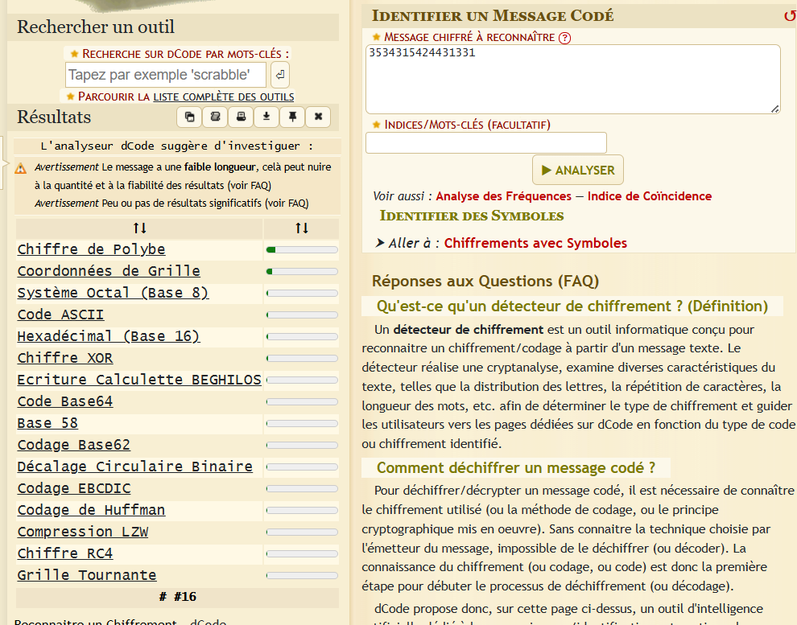
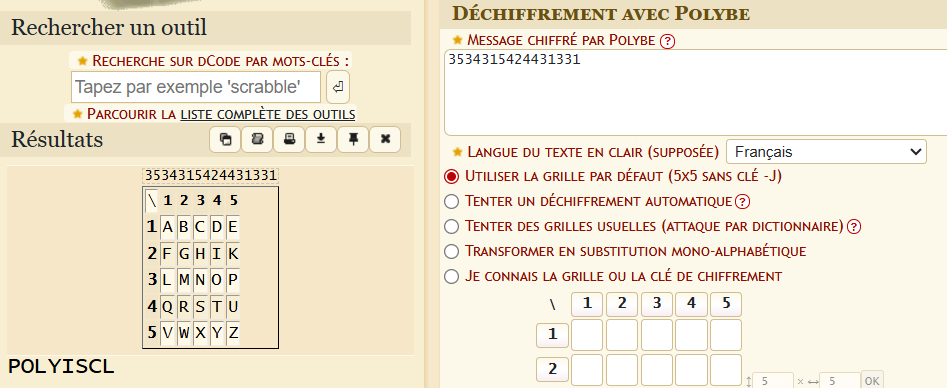

# Name: Hmm..!
**Level**: Medium  
**Points**: 500

## Description
All I have is this string of numbers, and I don’t know what to do with them.  
Can you figure it out?

**Numbers**: `3534315424431331`  

## Flag Format
 you may need _ in place of spaces

## Hints
- **Hint 1 (posted)**: "I love shapes"  
- **Hint 2 (via tickets)**: "Kawen jomla moufida" (Arabic for "Form a meaningful sentence")

## Solution
As is typical for crypto challenges, your first step should be to try decoding methods on [dcode.fr](https://www.dcode.fr/).  
Upon entering the number sequence, try the **Polybius cipher** (known in French as *chiffre de Polybe*).  

Decoding with the Polybius square gives the result:

Now, let's interpret the hints:

- **"I love shapes"** refers to the **Polybius Square**, since it's a cipher based on a 5x5 grid of letters.
- **"Kawen jomla moufida"** suggests you should form a **meaningful phrase** from the decoded letters.

From the cipher, you obtain the sequence: `POLYISCL`.  
Using the flag format guideline (underscores for spaces), a possible structure is: `POLY_IS_CL`.

Now, let’s deduce what “CL” could mean. It could stand for **Classic**, **Clear**, or maybe **Cool**.  
Given the playful tone, **Cool** is the best fit.

## Final Flag
The flag is case-insensitive.  
**Answer**: `Securinets{POLY_IS_COOL}`