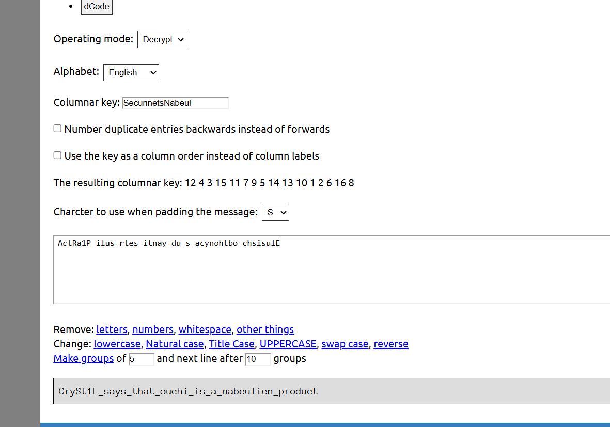

# CTF Challenge Writeup - **ouchi?**

- **Name:** ouchi?  
- **Level:** Medium  
- **Points:** 500  

---

## 🧩 Description

> my friend is always asking me about the meaning of "ouchi" but i don't know what is it , just a word we used to say ? password ? key ? i don't know !
>till one day she was playing a puzzle to find the meaning of this word , but we needed a key !
>So Army , all you need to do is to find the key and decrypt the cipher of the puzzle and finally find the meaning of "ouchi" 

---

## 🔐 Cipher

```
ActRa1P_ilus_rtes_itnay_du_s_acynohtbo_chsisulE
```

---

## 🛠️ Solution

We identified the cipher as a **Ubchi cipher**, a type of transposition cipher. The decryption was done using the following tool:

🔗 **Encoder/Decoder:** [Rumkin Ubchi Cipher Tool](https://rumkin.com/tools/cipher/ubchi/)

### Configuration Used:
- **Cipher type:** Ubchi
- **Operation mode:** Encrypt
- **Alphabet:** English
- **Columnar key:** `SecurinetsNabeul`
- **Number duplicates:** No
- **Use key as key:** No
- **Final columnar key (numeric order):**
  ```
  12 4 3 15 11 7 9 5 14 13 10 1 2 6 16 8
  ```
- **Padding character:** `S`
- **Groups of 5, new line after 10 groups**

---

## 🎯 Flag

```
Securinets{CrySt1L_says_that_ouchi_is_a_nabeulien_product}
```

---

