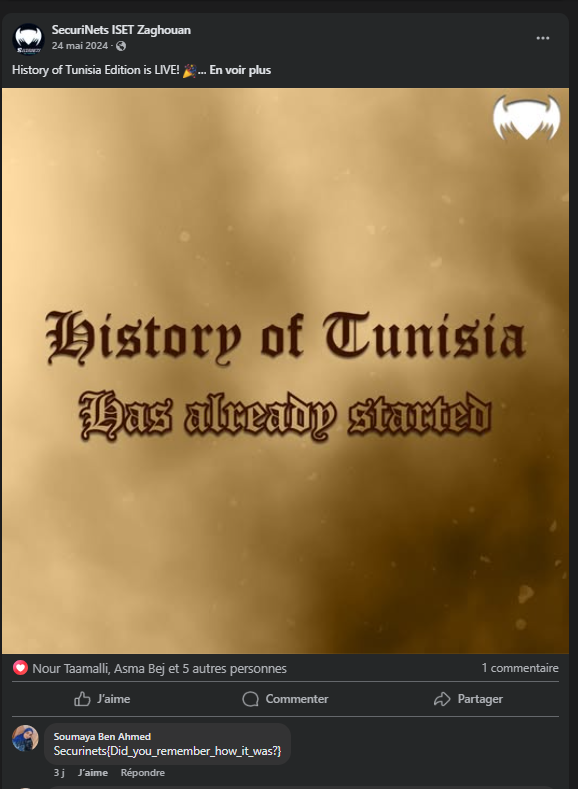

# Challenge Writeup: Blue and Brown

**Level:** Medium  
**Points:** 400  

---

## 🧩 Description

You’ll need to dig deep into the history of Tunisia to uncover the flag.

---

## 🧠 Solution

This challenge references the "History of Tunisia" — a Capture The Flag (CTF) event I authored last year under the name **Securinets ISETZG**.

Now, let’s examine the challenge title:

- **Blue** symbolizes the social media platform **Facebook**.
- **Brown** refers to the theme color used in the "History of Tunisia" CTF event.

With that context, and knowing both the platform and the event, you're expected to search deeper through relevant posts until you find the one that holds the key.

🔗 Relevant Facebook Post:  
[https://www.facebook.com/SecuriNets.ZG/posts/pfbid02dK8dAWVhRTCjMzJqTVhmPKgqaF3cDbtTWUZZzNuEa4uxVzTverCHzrxe8qJxytLQl](https://www.facebook.com/SecuriNets.ZG/posts/pfbid02dK8dAWVhRTCjMzJqTVhmPKgqaF3cDbtTWUZZzNuEa4uxVzTverCHzrxe8qJxytLQl)

---

## 🏁 Final Flag

The flag you’re looking for is:

**Securinets{Did_you_remember_how_it_was?}**
