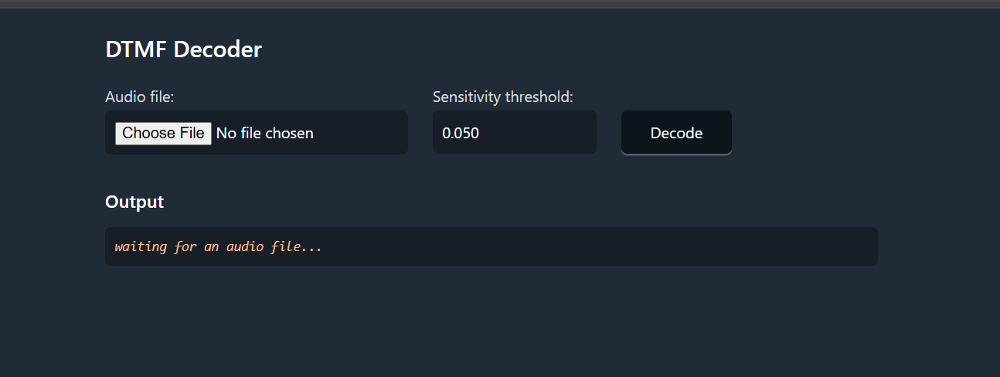

# Challenge Writeup: listen_carefully

**Points:** 100  
**Level:** Easy  

---

## 🧩 Description

It seems like someone is dialing a phone number — can you figure out what it is?  
The flag format is the decoded phone number wrapped in `Securinets{}` with no formatting.  
For example, if the number is `123-456-7890`, then the flag is `Securinets{1234567890}`.

---

## 🧠 Solution

To decode the audio, use a DTMF (Dual-Tone Multi-Frequency) decoder.  
A handy tool for this is:

🔗 [https://dtmf.netlify.app](https://dtmf.netlify.app)

- Adjust the **sensitivity** to `0.061` for accurate results.

---

## 🏁 Final Flag

After decoding the tones, you get the phone number:

**Securinets{4104553500}**
