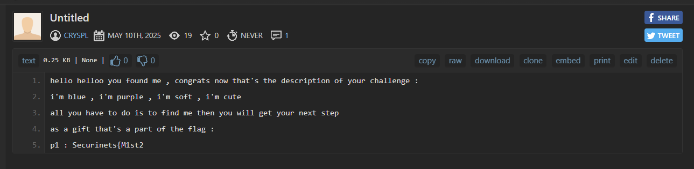
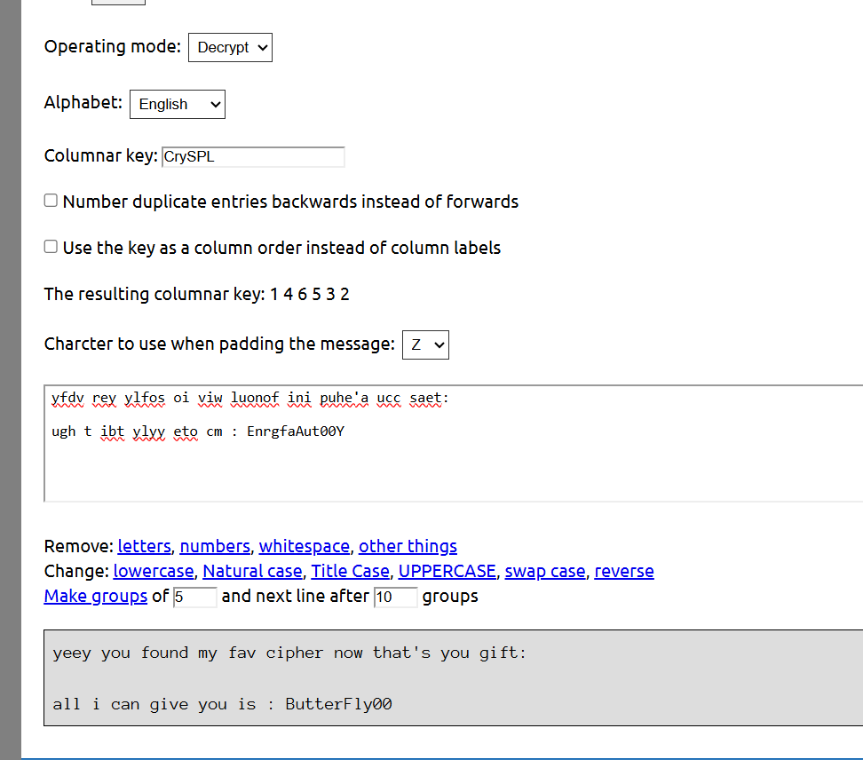
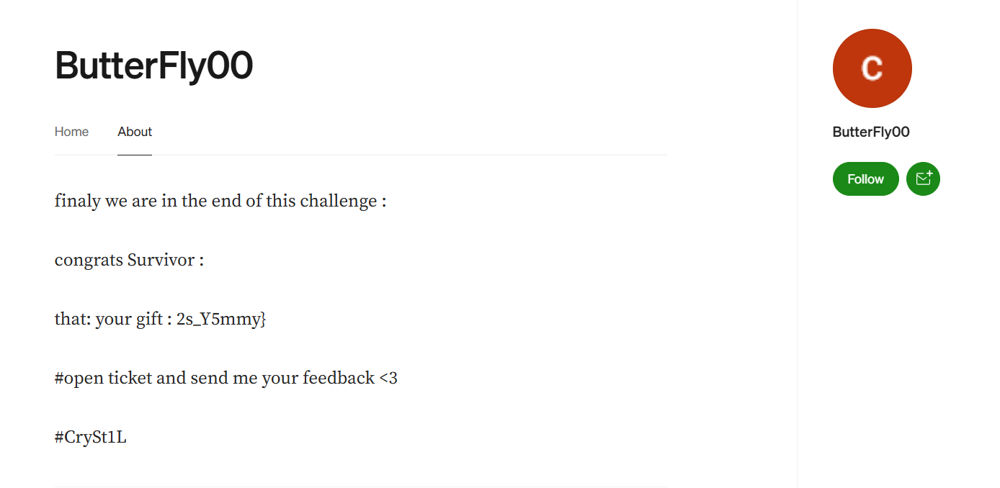

# Challenge Writeup: **Mastery**

**Level:** Hard  
**Points:** 800  
**Author:** CrySt1L  

---

## 🧩 Description

> all i can give you is : `CrySPL`

---

## 🧠 Solution

When you first look at the challenge, the only clue given is the string `CrySPL`. Your initial assumption might be that it’s a **username**.

---

### 🔍 Step 1: Username Reconnaissance

Start by checking for this username on multiple platforms.

1. **What'sMyName Tool**  
   Visit [https://whatsmyname.app/](https://whatsmyname.app/) from the [OSINT Framework](https://osintframework.com/).  
   However, you’ll notice that **Pastebin** is not listed among the checked sites.

2. **Sherlock Tool (Linux)**  
   Use the following command:
   ```bash
   sherlock CrySPL
   ```
   This will scan multiple platforms. Among the results, **Pastebin** stands out.

- 🔗 **Pastebin Profile:** [https://pastebin.com/u/CrySPL](https://pastebin.com/u/CrySPL)


---

### 📜 Step 2: Analyzing the Pastebin Description

Upon visiting the Pastebin profile, you find a cryptic description:



From this description, you get the **first part of the flag**.

Now let’s break down the hint inside the description.

---

### 🧠 Step 3: Decoding the Riddle

The description contains the lines:

```
i'm blue = blue.bsky platform  
i'm purple = (a distraction)  
i'm soft = lowercase letters  
i'm cute = (another distraction)
```

- The line **"i'm blue"** hints at the **Bluesky platform**: [https://bsky.app](https://bsky.app)
- **"i'm soft"** hints that the username is in **lowercase**: `cryspl`
- Searching for `cryspl` on Bluesky leads to:

🔗 [https://bsky.app/profile/cryspl.bsky.social](https://bsky.app/profile/cryspl.bsky.social)

---

### 🎁 Step 4: Finding the Second Part

In the **Bluesky bio**, you find:
> “congrats survivor you found me again,  
> that's your second gift: `ry_t1st`”

This is the **second part** of the flag.

---

### 🔐 Step 5: Final Decryption Challenge

Also included is an encrypted message:

```
yfdv rey ylfos oi viw luonof ini puhe'a ucc saet:
ugh t ibt ylyy eto cm : EnrgfaAut00Y
```

This looks like a **Ubchi cipher**.  
Head to [Rumkin Cipher Tools - Ubchi](https://rumkin.com/tools/cipher/ubchi/) and use `CrySPL` as the **columnar key**.



- After decryption, you get a username: `ButterFly00`

---

### 👀 Step 6: Another OSINT Sweep

Use **Sherlock** again with the new username. You can run it on multiple usernames via:

```bash
sherlock ButterFly00
```

Look for hint  **user number 33**, which points the profile in sherlock list :

🔗 [https://medium.com/@ButterFly00](https://medium.com/@ButterFly00)

Visit the profile and check the **About** section:



---

## 🏁 Final Flag

After collecting all the parts:

- First Part: `Securinets{M1st2`
- Second Part: ` ry_t1st`
- Third Part (from Medium): `2s_Y5mmy}`

✅ **Final Flag:**

```
Securinets{M1st2ry_t1st2s_Y5mmy}
```

---

## 🏆 Congratulations!

You've completed a challenging misc hybrid puzzle. This challenge tested your skills in:

- Username tracking across platforms
- Cipher decryption (Ubchi)
- Puzzle interpretation from bios/descriptions
- Deductive reasoning
