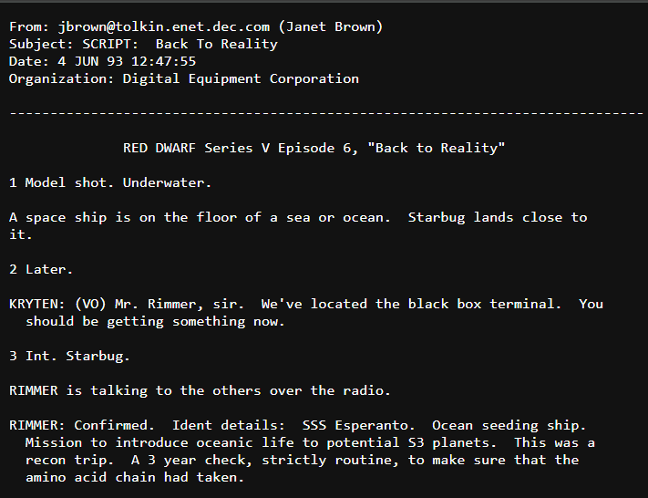
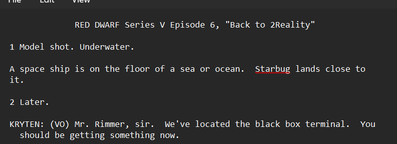
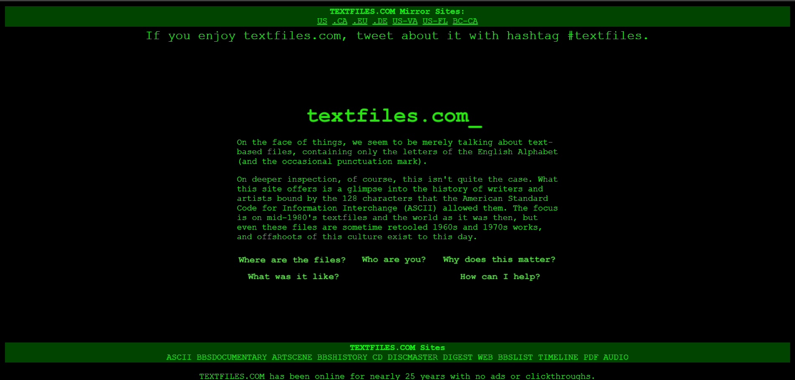
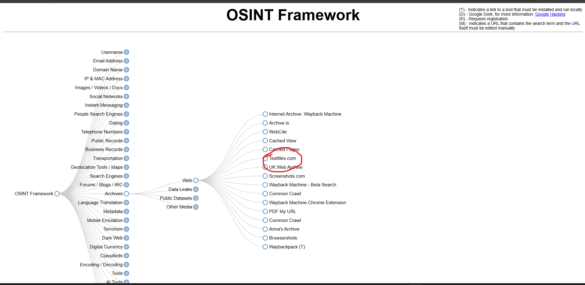
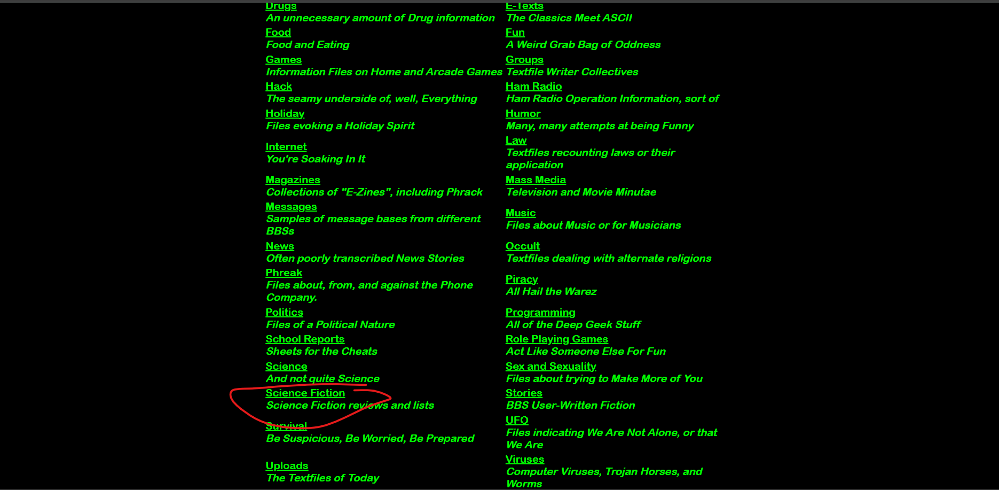

# Name: Green Script
**Level**: Medium  
**Points**: 500

## Description
6 juin, In the middle of the night, my phone rang, it was my friend Isabella. I picked up the phone immediately.  
"greeeeeeeeeen....greeeeeeeen...scripts....text....imagination....pleaaase....pleaaasee...help...help....uuugh!",  
she was saying while she was facing her asthma attack and I heard a sound of steps around her, then the call ended :(  
After several hours, the police located her last call and when we arrived we found her dead body and I found this paper in her pocket.  
**Detective, could you help us catch the killer of Isabella by identifying the source of this paper, sender name, sender address and the organization behind him?**

## Flag Format
`Securinets{PaperSourceLink_SenderName_SenderAddress_OrganizationNameAcronym}`

## Solution
First thing you will do is to interpret the file. You will search about it on the internet as usual, but you will only find 3 parts from the flag that may look like this in the file:  

Now all you need is the source of the file asked. Focusing on the file you will see in the weird title "2Reality":  

  

This points to the name of the file we are searching about.  
Now the title says: "Green Script" which points to the tool used here: [http://textfiles.com/](http://textfiles.com/) that only few people know, which totally looks green like a terminal:  

  

This tool exists in the OSINT framework, the OSINTER's best friends:  

  

Later I posted a hint that says: "Archives / science fiction" which may point there too.  
**Archives** means the textfiles archives.  
**Science fiction** means the section where this file exists in the archives:  

  

So the final source wanted is: `http://textfiles.com/sf/2reality.txt`

## Final Flag
`Securinets{http://textfiles.com/sf/2reality.txt_Janet_jbrown@tolkin.enet.dec.com_DEC}`