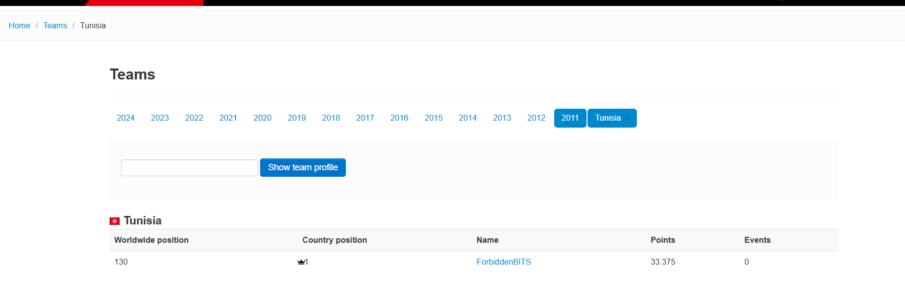

# Name: World Wide
**Level**: Medium  
**Points**: 300

## Description
Hello, survivor!  
Your mission for this challenge is to identify the **first team** that ventured into this world of surprises and managed to raise a red flag.  
You need to determine **the team's name**, **the year they began their CTF journey**, and **their global ranking that year**.  
Good luck!

## Flag Format
`Securinets{NameTeam_Year_Position}`

## Solution
Let’s break down the clues in the description:

- **"The first team that dived into this world of surprises"** refers to the **first team** that started participating in **Capture The Flag (CTF)** competitions.
- **"To raise a red flag"** subtly points to **Tunisia**, known for its red national flag.

So where can we find such historical information?  
The answer lies in **[CTFtime](https://ctftime.org/)** — the main platform for tracking CTF competitions and team performance.

By searching the CTFtime archives, which began in **2011**, we identify the **first Tunisian team** to appear in that year.  
That team was:

With this, you have everything you need to construct the flag:

## Final Flag
`Securinets{ForbiddenBITS_2011_130}`